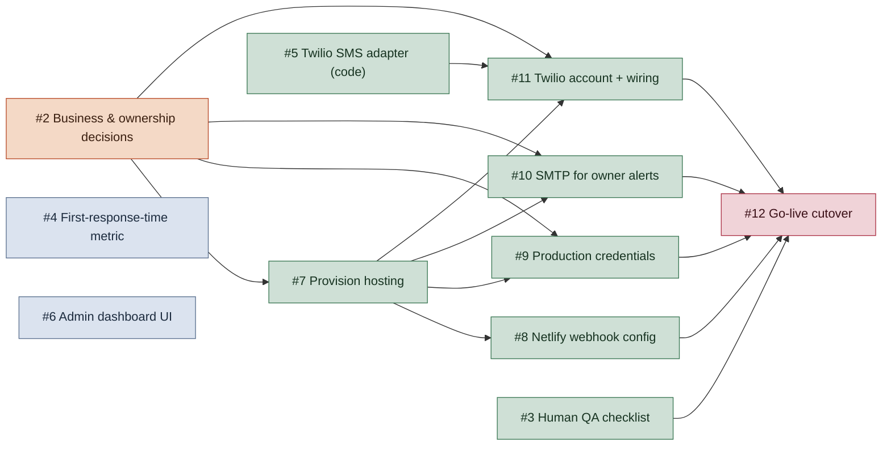

# Roadmap — What's Left

The coordinator backend itself is built and merged (PR #1): lead intake,
guardrails, scheduling assist, messaging, closeout, reporting, audit
logging, and owner alerts, all covered by the acceptance test suite. What's
tracked below is everything between "the code works" and "a real customer
can talk to it" — plus a couple of independent quality-of-life items.

GitHub Issues (#2–#12 in this repo) are the live source of truth — check
them off there, not here. This diagram is a snapshot of how they block each
other; it won't update itself when an issue closes or a new one gets filed.

**Reading it:** an arrow means "the tail blocks the head" — #2 has to close
before #7 can reasonably start, not just before it finishes. Tan = business
decision (yours to make, not code). Green = go-live infrastructure. Blue =
independent improvements that don't block launch. Red = the actual cutover.

**Two nodes have no arrows on purpose** — #4 (first-response-time metric)
and #6 (admin dashboard) don't block anything and aren't blocked by
anything. They're real, tracked work, just not on the critical path to
going live.

**What's deliberately not here:** voice calls, autonomous pricing,
payments, contractor payouts, parts purchasing. Those aren't backlog items
— they're out of scope for this pilot by design (see the job description's
Phase-One Channels section and `pilot-plan.md`), so they don't get tickets.
